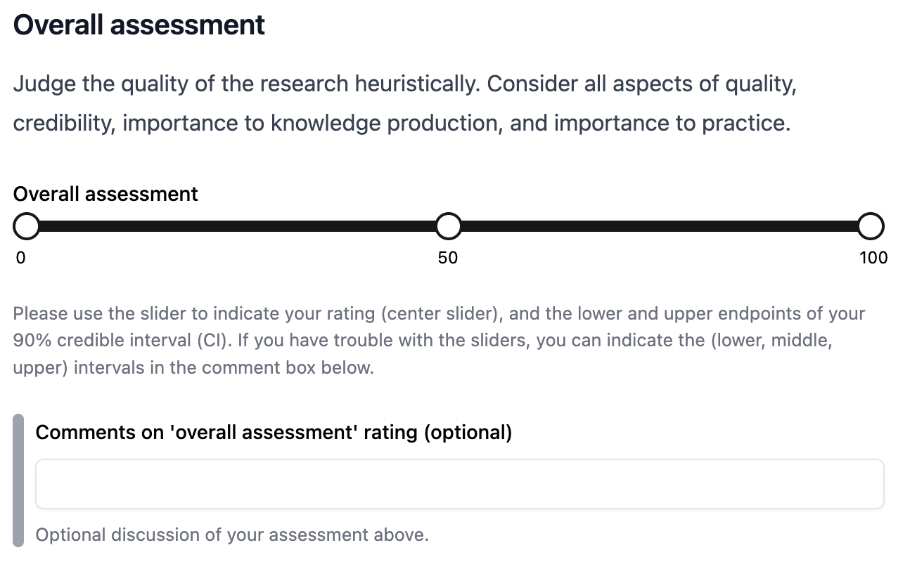
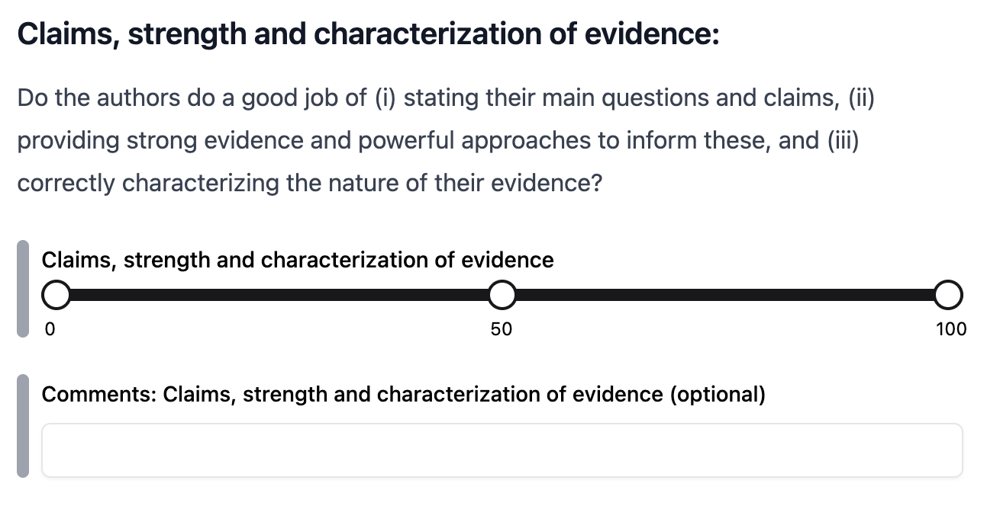

<style>
.reveal section p,
.reveal section li {
  line-height: 1.5;
  margin-bottom: 0.25em;
}

.reveal section {
  overflow: auto;
}

.small-text { font-size: 80%; }
.tiny-text  { font-size: 60%; }

</style>


## The Unjournal

*Public Journal-Independent Evaluation of Impactful Research*

::: {.columns}

::: {.column width="80%"}

- Focus: rigorous, policy‑relevant social science and economics  
- Not a journal. No accept/reject. We publish evaluations and ratings, not papers  
- Everything citable and reusable 


*Detour*: [The Unjournal's mission, approach, and progress](https://docs.google.com/presentation/d/11OZgsbg2d9vDgs81akNaTqQti96uw1YQ_z6_BtrGhpI/edit?usp=sharing)

:::

::: {.column width="20%"}


:::

:::


----


### How it works

**Evaluations**: 

- Narrative reports focusing on credibility and usefulness 

- Claim ID & assessment 

- Structured percentile ratings: overall + 7 criteria

- Journal tier ratings and predictions

<br> 

::: {.fragment}

**Publish & update**: PubPub package, DOIs, summaries, author responses

:::


::: {.notes}
Skip this slide if going through Google slides detour 
:::


---

## Quantitative ratings

> Percentile ratings: For each of the criteria below, please rank this paper relative to all serious research in the same area that you have encountered in the last three years.


::: {.fragment}

I. **Overall assessment** — Heuristic judgment of quality, credibility, importance

- Midpoint rating

- 90% credible interval (CI)

:::

::: {.fragment}

:::{.center}

{width=50%}


:::

::: 


---

## Quantitative ratings (0 - 100 pctl.)

<br>

II. **Claims**, strength and characterization of evidence
 
::: {.notes}
Do the authors do a good job of (i) stating their main questions and claims, (ii) providing strong evidence and powerful approaches to inform these, and (iii) correctly characterizing the nature of their evidence?
:::

<br style="line-height:0.5">

III.  **Methods:** Justification, reasonableness, validity, robustness assessment 

::: {.notes}
....clearly justified and explained? Are methods and their underlying assumptions reasonable and appropriate? Are the results likely to be robust to changes in the assumptions? Have the authors avoided bias and questionable research practices? 
:::

<br style="line-height:0.5">

III. **Advancing knowledge & practice** 

::: {.notes}
*Contribution to the field and relevance to impactful interventions*

To what extent does the project contribute to the field or to practice, particularly in ways that are directly or indirectly relevant to global priorities and impactful interventions?
::: 


---

## Quant. ratings (0 - 100)

<br>

IV. **Logic & communication** 


::: {.notes}

*Clear definitions, reasoning transparency,conclusions consistent with evidence/proofs, relevant clear data/analysis*

"Are concepts clearly defined? Is the reasoning transparent? Are conclusions consistent with the evidence (or formal proofs) presented?  Do the authors accurately state the nature of their evidence, and the extent it supports their main claims? Are the data and/or analysis, including tables and figures, relevant to the argument?" 

:::


<br style="line-height:0.5">

V. **Open, collaborative, replicable**


::: {.notes}

*Reproducibility and clarity for replication; data availability and integrity*

Would another researcher be able to replicate the analysis? Are the method and its details explained sufficiently?  Is the source of the data clear?  Is the data made as widely available as possible, with clear labeling and explanation? Do the authors provide resources that are likely to enable future research and meta-analysis?

:::


<br style="line-height:0.5">

VI. **Relevance** to global priorities, **usefulness** for practitioners


::: {.column width="40%"}


::: 

::: {.notes}

*High-impact topic, realistic assumptions, reporting relevant results*

Are the paper’s chosen topic and approach likely to be useful to global priorities, cause prioritization, and high-impact interventions? 

Does the paper consider real-world relevance and deal with policy and implementation questions? Are the setup, assumptions, and focus realistic?  Do the authors report results that are relevant  to practitioners? Do they provide useful quantified estimates (costs, benefits, etc.)?

:::


---

##  Journal ranking tiers (0.0–5.0)

::: {.notes}

We give a specific description of what these tiers mean, along with some examples.

E.g., 

"4/5: Marginal A-Journal/Top field journal... examples: EJ, JLE"

"3/5: Top B-journal/Strong field journal... examples: JDE, Exp. Econ"


:::


<br>

1. **Normative**: Where this **should** be published if the process were fair, unbiased, and ~aligned to the category metrics above.
   
<br>
   
2. **Predictive**: Where this **will** likely be published given real‑world processes.


---

## Output: Example


---


## LLM evaluation output, comparison to Unjournal human evaluator ratings

<!-- DR @VK -- not sure what you wanted for this section -->


---

### Our goals and questions: General 


1. Measure the value of *frontier* AI research-eval. relative to human peer review 

::: {.notes}
Is state-of-the-art AI research evaluation reliable and useful enough to replace human peer review in any contexts? 

Reverse question (Unjournal was asked): "Are human evaluations worth it"?

How well can it predict what humans will report? 

What are its strengths & weaknesses relative to humans, e.g., in terms of?

(1) Predicting journal outcomes, citations, etc. (2) Generating feedback deemed most useful by humans (30 Spotting research errors (4) Diagnosing different types of strengths and limitations (e.g., reasoning transparency, justification of methods and assumptions, communication) (5) Judging content without biases/statistical discrimination based on prestige labels, etc.

:::


2. Compare *methods* for AI research-evaluation, find the best approaches

::: {.notes}

Which come closer to (the desirable features of) human evaluations and in which ways? 

What gets closest to the 'frontier', doing better in terms of outcomes like those  mentioned above?

:::


3. The nature of frontier AI 'preferences & tastes' over research

::: {.notes}

1. Which types of papers and approaches do default models tend to 'like' more/less relative to humans when given the same guidelines?

2. Do we see signs of characteristic preferences that help us understand how AIs are likely to prioritize, conduct, and evaluate research? 

:::

4. Hybrid human-AI performance (later)


<!-- 

1. Which types of papers do default models tend to 'like' more/less relative to humans when given the same guidelines?

2. How do it's criteria ratings tend to differ from humans?

-->


## Literature 

**@Pataranutaporn2025 **

<br style="line-height:0.5">

1220 papers "from 110 economics journals excluded from the training data of current LLMs"

LLMs asked: "make a publication recommendation" ... 6-point scale from "1 = Definite Reject..." to "6. Accept As Is...".

<br style="line-height:0.5">

::: {.fragment}


Also, a 10-point scale for originality, rigor, scope, impact...

And 330 papers with various 'remove or change names and institutions' treatments

:::

<br style="line-height:0.5">

::: {.fragment}

**Results:**  Aligned w/ journal REPEC rankings, evidence of bias (gender, institution)

:::


<!--
@Pataranutaporn2025 asked four nearly state-of-the-art LLM models (GPT-4o mini, Claude 3.5 Haiku, Gemma 3 27B, and LLaMA 3.3 70B) to consider 1220 unique papers "drawn from 110 economics journals excluded from the training data of current LLMs". They prompted the models to act "in your capacity as a reviewer for [a top-5 economics journal]" and make a publication recommendation using a 6-point scale ranging from "1 = Definite Reject..." to "6. Accept As Is...". They asked it to evaluate each paper on a 10-point scale for originality, rigor, scope, impact, and whether it was 'written by AI'. They also (separately) had LLMs rate 330 papers with the authors' identities removed, or replacing the names with fake male/female names and real elite or non-elite institutions (check this) or with prominent male or female economists attached. 

They compare the LLMs' ratings with the RePEC rankings for the journals the papers were published in, finding general alignment. They find mixed results on detecting AI-generated papers. In the names/institutions comparisons, they also find the LLMs show biases towards named high-prestige male authors relative to high-prestige female authors, as well as biases towards elite institutions and US/UK universities. (Doublecheck the details here). 
--> 

---

**@Zhang2025Replication**

<br> 

AI conference paper data
 
LLM agents performed pairwise comparisons among manuscripts

<br> 

::: {.fragment}


*Accept/reject decisions:* "agreement between AI & human reviewers... roughly on par with the consistency observed between independent human review committees"

<br style="line-height:0.5">

Again, evidence of biases/~statistical discrimination towards, e.g., "‘"papers from established research institutions"
:::

::: {.notes}

Pairwise comparison outperformed (LLM) rating-based methods in identifying high-impact papers (by citation metrics).

Maybe we should consider pairwise comparison algorithms in our future prompting.

:::

--- 

### Our context, advantages

- Actual *human* evaluations of research 

- In econ. & adjacent 

- Reports, ~benchmarked ratings, predictions (journal-tier ground-truth)


<br>

::: {.fragment}

*Potential:* 

- Train & benchmark models on human evals

- Future eval. pipeline: clean out-of-time predictions & evaluation

- Multi-armed trials on future human/hybrid evals (cf. Brodeur et al, '25; Qazi et al, '25)

:::

::: {.notes}
We could also ask/pay future evaluators & authors to act as enumerators to judge LLM content
:::


## Our initial LLM pipeline

<!-- DR @VK: I think we need at least 1-2 slides about our prompt, the model we used, how we fed it the papers, etc. -->

**Prompt**

Copied from evaluator guidelines, removed mention of "Unjournal" 

Added 'role' and ~debiasing instructions


<br style="line-height:0.5">

::: {.tiny-text}


> Your role -- You are an academic expert as well as a practitioner across every relevant field -- use all your knowledge and insight. You are acting as an expert research evaluator/reviewer. 

> Do not look at any existing ratings or evaluations of these papers you might find on the internet or in your corpus, do not use the authors' names, status, or institutions in your judgment -- give these ratings based on the *content* of the papers alone; do the assessment based on your knowledge and insights. 

:::

<br style="line-height:0.5">

Enforce JSON Schema: midpoint and bounds for each criteria, short rationale


---

Model: GPT-5 or GPT-5 pro


```{r}
#| label: setup-libs

library("tidyverse")
library("janitor")
library("stringr")
library("stringi") #probably redundant?
library("lubridate")
library("here") 
library("knitr") 
library("ggforce") 
library("ggrepel")
library("glue")
# library("ggalluvial")
library("scales")
# library("ggbreak")

library("plotly")


UJ_ORANGE <- "#f19e4b"   # LLM
UJ_GREEN  <- "#99bb66"   # Human

theme_uj <- function(base_size = 11) {
  theme_minimal(base_size = base_size) +
    theme(
      panel.grid.minor = element_blank(),
      plot.title.position = "plot",
      legend.position = "bottom"
    )
}

 
```


```{r}
#| label: load-data-tiers


# paper_authors <- read_delim("data/paper_authors.csv", delim = ",")

# Mapping paper keys - short titles
UJmap <- read_delim("data/UJ_map.csv", delim = ";") |>
  mutate(label_paper_title = research,
         label_paper = paper) |>
  select(c("label_paper_title", "label_paper"))


# Unjournal ratings
rsx <- read_csv("data/rsx_evalr_rating.csv", show_col_types = FALSE) |> 
  clean_names()  |>
  mutate(label_paper_title = research) |>
  select(-c("research"))


# UJ evaluated research
research <- read_csv("data/research.csv", show_col_types = FALSE) |>
  clean_names() |>
  filter(status == "50_published evaluations (on PubPub, by Unjournal)") |>  
  left_join(UJmap, by = c("label_paper_title")) |>
  mutate(doi = str_trim(doi)) |>
  mutate(label_paper = if_else(doi == "https://doi.org/10.3386/w31162", "Walker et al. 2023", label_paper, missing = label_paper)) |>
  mutate(label_paper = if_else(doi == "doi.org/10.3386/w32728", "Hahn et al. 2025", label_paper, missing = label_paper))  |>
  mutate(label_paper = if_else(doi == "https://doi.org/10.3386/w30011", "Bhat et al. 2022", label_paper, missing = label_paper))  |>
  mutate(label_paper = if_else(doi == "10.1093/wbro/lkae010", "Crawfurd et al. 2023", label_paper, missing = label_paper))  |>
  left_join(rsx, by = c("label_paper_title"))
 

jtiers_llm <- read_csv("data/tiers_long.csv", show_col_types = FALSE) |>
  mutate(middle_rating = score,
         lower_ci = lo,
         upper_ci = hi,
         criteria = if_else(tier_kind == "tier_will", "journal_predict", "merits_journal"),
         evaluator = "gpt-5",
         label_paper = paper
         ) |>
  select(c("label_paper", "evaluator", "middle_rating", "lower_ci", "upper_ci" , "criteria", "rationale"))


jtiers_uj <- research |>
  filter(criteria== "merits_journal" | criteria == "journal_predict") |>
  mutate(paper = label_paper,
         rationale = "")  |>
  select(c("label_paper", "evaluator", "middle_rating", "lower_ci", "upper_ci" , "criteria", "rationale"))


jtiers <- jtiers_uj |>
  rbind(jtiers_llm) |>
  mutate(human = if_else(evaluator == "o3", "Human", "o3"),
         lower_ci = if_else(lower_ci > 10, lower_ci/10, lower_ci))


# write_csv(all_ratings, "data/all_jtiers.csv")
write_rds(
  jtiers,
  "data/all_jtiers.rds",
  compress = "none"
  )

# utilities + clean columns for plotting

lane_offsets_center <- function(m, gap = 0.18) {
  if (m <= 0) return(numeric(0))
  if (m == 1) return(0)
  k <- floor((m - 1)/2)
  offs <- sort(c(-seq_len(k), 0, seq_len(k))) * gap
  offs[seq_len(m)]
}
lane_offsets_skip0 <- function(m, gap = 0.18) {
  if (m <= 0) return(numeric(0))
  if (m == 1) return(gap)
  k <- ceiling(m/2)
  offs <- sort(c(-seq_len(k), seq_len(k))) * gap
  offs[seq_len(m)]
}

jt_use <- jtiers |>
  transmute(
    label_paper,
    criteria,
    who = if_else(evaluator == "gpt-5", "LLM", "Human"),
    mid = as.numeric(middle_rating),
    lo  = suppressWarnings(as.numeric(lower_ci)),
    hi  = suppressWarnings(as.numeric(upper_ci))
  ) |>
  mutate(
    lo = ifelse(is.finite(lo), pmax(1, pmin(5, lo)), NA_real_),
    hi = ifelse(is.finite(hi), pmax(1, pmin(5, hi)), NA_real_)
  )

tier_metric <- "merits_journal"  # change "merits_journal" to "journal_predict" for the other slide

```


```{r}
#| label: load-data-metrics
# Rebuild 0–100 metrics cleanly (LLM + all human ratings)

canon_metric <- function(x) dplyr::recode(
  x,
  "advancing_knowledge" = "adv_knowledge",
  "open_science"        = "open_sci",
  "logic_communication" = "logic_comms",
  "global_relevance"    = "gp_relevance",
  "claims_evidence"     = "claims",
  .default = x
)

# LLM metrics
metrics_llm <- readr::read_csv(here("data","metrics_long.csv"), show_col_types = FALSE) |>
  janitor::clean_names() |>
  mutate(
    label_paper = stringr::str_replace(paper, "et al ", "et al. "),
    criteria    = canon_metric(metric),
    mid = as.numeric(midpoint),
    lo  = suppressWarnings(as.numeric(lower_bound)),
    hi  = suppressWarnings(as.numeric(upper_bound)),
    who = "LLM"
  ) |>
  transmute(label_paper, criteria, who, mid, lo, hi) |>
  mutate(
    lo = ifelse(is.finite(lo), pmax(0, pmin(100, lo)), NA_real_),
    hi = ifelse(is.finite(hi), pmax(0, pmin(100, hi)), NA_real_)
  )

# Human metrics (use your earlier rsx + research mapping)
rsx_research <- rsx |>
  left_join(research |> select(label_paper_title, label_paper), by = "label_paper_title")

metrics_human <- rsx_research |>
  mutate(criteria = canon_metric(criteria)) |>
  filter(criteria %in% c("overall","claims","methods","adv_knowledge","logic_comms","open_sci","gp_relevance")) |>
  transmute(
    label_paper,
    criteria,
    evaluator,
    who = "Human",
    mid = as.numeric(middle_rating),
    lo  = suppressWarnings(as.numeric(lower_ci)),
    hi  = suppressWarnings(as.numeric(upper_ci))
  ) |>
  filter(!is.na(label_paper), !is.na(mid)) |>
  mutate(
    lo = ifelse(is.finite(lo), pmax(0, pmin(100, lo)), NA_real_),
    hi = ifelse(is.finite(hi), pmax(0, pmin(100, hi)), NA_real_)
  ) %>% 
  # remove exact duplicates (protect against tiny float diffs by rounding first) -- but wait, what if human raters rated identically for a category?
  mutate(across(c(mid, lo, hi), ~ round(.x, 4))) |>
  distinct(label_paper, criteria, who, evaluator, mid, lo, hi, .keep_all = FALSE)


metrics_use <- bind_rows(metrics_human, metrics_llm)

```

--- 


### Initial concrete questions (~exploratory/descriptive)

<!-- NEED TO REFINE -- DR @VK: I suggest we only state questions here that we are actually providing evidence on below, and try to state the questions very specifically -->


1. Overall characteristics of ratings

::: {.notes}

1A. Mean ratings by rating and paper category  

1B. Scale use, dispersion, clustering

1C. Multi-dimensionality of ratings (~PCA)

:::


<bs>

2. Associations between (untrained) LLM & human ratings & predictions

::: {.notes}
2A. For overall ratings

2B. For journal tier ratings/predictions

2C. For multi-dimensional criteria

2D. LLM vs human vs inter-human inter-rater reliability 

:::

<bs>

3. Informal exploration of "strong LLM-human ratings gaps" 


*See all results-in-progress [here](https://llm-uj-research-eval.netlify.app/results)*


---

### Overall ratings: Unjournal vs GPT-5

Overall rating 


```{r}
#| label: fig-scatter-overall-metrics
#| fig-width: 20
#| fig-height: 8

library(plotly)

Hm <- metrics_use |> filter(criteria == "overall", who == "Human") |>
  transmute(label_paper, mid_h = mid, lo_h = lo, hi_h = hi)

Lm <- metrics_use |> filter(criteria == "overall", who == "LLM") |>
  transmute(label_paper, mid_l = mid, lo_l = lo, hi_l = hi) |>
  distinct()

HLM <- Hm |> inner_join(Lm, by = "label_paper") |>
  mutate(
    ex  = pmax(0, hi_h - mid_h),  exm = pmax(0, mid_h - lo_h),
    eyy = pmax(0, hi_l - mid_l),  eym = pmax(0, mid_l - lo_l),
    diff = mid_l - mid_h,
    hover = sprintf("<b>%s</b><br>Human: %.1f [%.1f, %.1f]<br>LLM: %.1f [%.1f, %.1f]<br>\u0394=%.1f",
                    label_paper, mid_h, lo_h, hi_h, mid_l, lo_l, hi_l, diff)
  )

AXm <- list(range = c(0,100), dtick = 10, title = "Human (overall)",
            zeroline = FALSE, showgrid = FALSE, tickfont = list(size = 26), titlefont = list(size = 28))
AYm <- list(range = c(0,100), dtick = 10, title = "LLM (overall)",
            zeroline = FALSE, showgrid = FALSE, tickfont = list(size = 26), titlefont = list(size = 28))

plot_ly(HLM) |>
  add_markers(x = ~mid_h, y = ~mid_l,
              marker = list(size = 24, color = UJ_ORANGE, line = list(width = 0), alpha = 0.8),
              # error_x = list(type = "data", array = ~ex,  arrayminus = ~exm, thickness = 3, color = UJ_GREEN),
              # error_y = list(type = "data", array = ~eyy, arrayminus = ~eym, thickness = 3, color = UJ_ORANGE),
              hovertemplate = ~hover, showlegend = FALSE) |>
  add_lines(x = c(0,100), y = c(0,100),
            line = list(dash = "dash", width = 2, color = "gray60"),
            hoverinfo = "none", showlegend = FALSE) |>
  layout(xaxis = AXm, yaxis = AYm,
         hoverlabel = list(font = list(size = 24)),
         margin = list(l = 60, r = 30, t = 50, b = 50))

```


---

### Journal tier rating: Unjournal vs GPT-5

::: {.columns}

::: {.column width="50%"}


- Where *should* this be published?

```{r}
#| label: scatter-tiers-rating
#| fig-width: 8
#| fig-height: 8
#| fig-align: center

library(plotly)

# Humans and LLM for the chosen tier metric
H <- jt_use |> filter(criteria == tier_metric, who == "Human",
                      is.finite(mid)) |>
  select(label_paper, who, mid_h = mid, lo_h = lo, hi_h = hi)

L <- jt_use |> filter(criteria == tier_metric, who == "LLM") |>
  select(label_paper, mid_l = mid, lo_l = lo, hi_l = hi)

HL <- H |> inner_join(L, by = "label_paper") |>
  mutate(
    ex  = pmax(0, hi_h - mid_h), exm = pmax(0, mid_h - lo_h),
    eyy = pmax(0, hi_l - mid_l), eym = pmax(0, mid_l - lo_l),
    diff = mid_l - mid_h,
    hover = sprintf(
      "<b>%s</b><br>Human: %.2f [%.2f, %.2f]<br>LLM: %.2f [%.2f, %.2f]<br>\u0394=LLM−Human: %.2f",
      label_paper, mid_h, lo_h, hi_h, mid_l, lo_l, hi_l, diff)
  )

AX <- list(range = c(1,5), dtick = 1, title = "Human tier",
           zeroline = FALSE, showgrid = FALSE, tickfont = list(size = 28), titlefont = list(size = 28))
AY <- list(range = c(1,5), dtick = 1, title = "LLM tier",
           zeroline = FALSE, showgrid = FALSE, tickfont = list(size = 28), titlefont = list(size = 28))

plot_ly(HL) |>
  add_markers(x = ~mid_h, y = ~mid_l, name = "Paper",
              marker = list(size = 22, color = UJ_GREEN, line = list(width = 0), alpha = 0.7),
              # error_x = list(type = "data", array = ~ex, arrayminus = ~exm, thickness = 3, color = UJ_GREEN),
              # error_y = list(type = "data", array = ~eyy, arrayminus = ~eym, thickness = 3, color = UJ_ORANGE),
              hovertemplate = ~hover, showlegend = FALSE) |>
  add_lines(x = c(1,5), y = c(1,5), name = "y = x",
            line = list(dash = "dash", width = 2, color = "gray60"),
            hoverinfo = "none", showlegend = FALSE) |>
  layout(xaxis = AX, yaxis = AY,
         hoverlabel = list(font = list(size = 24)),
         margin = list(l = 60, r = 30, t = 50, b = 50))

```

:::

::: {.column width="50%"}

- Where *will* this be published?

```{r}
#| label: scatter-tier-predict
#| fig-width: 8
#| fig-height: 8
#| fig-align: center


tier_metric <- "journal_predict"  # change "merits_journal" to "journal_predict" for the other slide


# Humans and LLM for the chosen tier metric
H <- jt_use |> filter(criteria == tier_metric, who == "Human",
                      is.finite(mid)) |>
  select(label_paper, who, mid_h = mid, lo_h = lo, hi_h = hi)

L <- jt_use |> filter(criteria == tier_metric, who == "LLM") |>
  select(label_paper, mid_l = mid, lo_l = lo, hi_l = hi)

HL <- H |> inner_join(L, by = "label_paper") |>
  mutate(
    ex  = pmax(0, hi_h - mid_h), exm = pmax(0, mid_h - lo_h),
    eyy = pmax(0, hi_l - mid_l), eym = pmax(0, mid_l - lo_l),
    diff = mid_l - mid_h,
    hover = sprintf(
      "<b>%s</b><br>Human: %.2f [%.2f, %.2f]<br>LLM: %.2f [%.2f, %.2f]<br>\u0394=LLM−Human: %.2f",
      label_paper, mid_h, lo_h, hi_h, mid_l, lo_l, hi_l, diff)
  )

AX <- list(range = c(1,5), dtick = 1, title = "Human tier",
           zeroline = FALSE, showgrid = FALSE, tickfont = list(size = 28), titlefont = list(size = 28))
AY <- list(range = c(1,5), dtick = 1, title = "LLM tier",
           zeroline = FALSE, showgrid = FALSE, tickfont = list(size = 28), titlefont = list(size = 28))

plot_ly(HL) |>
  add_markers(x = ~mid_h, y = ~mid_l, name = "Paper",
              marker = list(size = 22, color = UJ_GREEN, line = list(width = 0), alpha = 0.7),
              # error_x = list(type = "data", array = ~ex, arrayminus = ~exm, thickness = 3, color = UJ_GREEN),
              # error_y = list(type = "data", array = ~eyy, arrayminus = ~eym, thickness = 3, color = UJ_ORANGE),
              hovertemplate = ~hover, showlegend = FALSE) |>
  add_lines(x = c(1,5), y = c(1,5), name = "y = x",
            line = list(dash = "dash", width = 2, color = "gray60"),
            hoverinfo = "none", showlegend = FALSE) |>
  layout(xaxis = AX, yaxis = AY,
         hoverlabel = list(font = list(size = 24)),
         margin = list(l = 60, r = 30, t = 50, b = 50))

```

:::

:::

---


## Our next steps (feedback invited)

::: {.notes}

1. Statistical analyses we want to do 

- Intuitive information theoretic and Bayesian measures and tests 

- Multi-level modeling (random and mixed effects)

2. Content-swap 'bias tests' (ala @Pataranutaporn2025)

3. Predict journal-outcome/bibliometrics horse-race 

4. Refine LLM model, compare dimensions, test

5. Explore/analyse descriptive evaluation content 

6. Human enumerators

7. Train 'predict human evaluations' model, preregister for future evaluations (out-of-time validation)

8. Possible hybrid human-AI trials

9. Consider "policy measures"; how do we decide and agree upon whether AI, Human, or Hybrid are 'better' at this?

10. Implications for Unjournal/evaluation processes

:::


## Thank you!


{width=90%}

  
Scan to visit  
[unjournal.org](https://unjournal.org)


---


## References {.unnumbered}


::: {#refs}
:::
